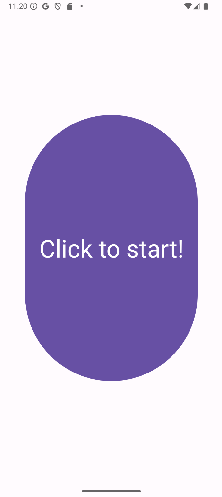

# GenAI_Hackathon
## App Name: HeartLight Assitant 
### To Groupmates 
Since this is an android app, it is very likely that you cannot open the project unless you have downloaded Android Studio and Android Emulator. To demonstrate, I have shown some pictures below.   
If you have any ideas or suggestions, feel free to git clone this repository and modify them, or contact me.    
This app is still a preview version and is flawed in terms of color, layout, logic and many other things. Pls do not hesitate to help me improve it!       
**What to do next?** Simon is working on his LLM and will integrate it into the app soon   
Pls chase up a bit    
**Sad story**: Simon and I are going to have at least 2 mid-term -tests next week...
### Overview 
The Accessibility App is designed to empower visually impaired individuals by providing them with a seamless and intuitive way to navigate their environment. By utilizing voice commands and real-time object detection, this app enhances independence and safety, allowing users to focus on their tasks without visual distractions. 
### Key Features
1. **Voice Activation**: Users can activate the app by simply long-pressing the screen. This intuitive gesture allows for hands-free operation, making it easier for visually impaired users to interact with the app.
2. **Object Detection**: Once activated, the app utilizes the device's camera to continuously monitor the user's surroundings. Advanced object detection algorithms identify key environmental elements, such as obstacles, pathways, and important landmarks.
3. **Real-Time Feedback**: The app provides auditory feedback, alerting users to essential information about their environment. For example, it can announce the presence of obstacles like trash cans, busy streets, or crowded areas, enhancing situational awareness.
Voice Commands for Navigation: Users can verbally instruct the app about their intended destination  (e.g., "I want to go to the convenience store"). The app processes these commands and helps guide the user accordingly.
4. **Continuous Monitoring**: The app remains active, continuously scanning the environment and providing updates until the user decides to stop the service. This ensures that users have constant support while navigating their surroundings.
### Screen View 
 
 

### How-to-guide  
1. **Launching the App**: Open the Accessibility App on your device.
2. **Activating Voice Control**: Long-press the screen to activate the microphone. This gesture signals the app to listen for voice commands.
Giving Commands: Clearly state your destination or intention. For example, you can say:   
"I want to go to the convenience store."    
"Take me to school."    
"I need to buy something at the mall."   
3. **Receiving Feedback**: As you navigate, listen for auditory cues from the app. It will inform you of obstacles, changes in terrain, and other critical information about your environment.
4. E**nding the Session**: When you are finished using the app or wish to stop the service, simply say "stop" the screen again to deactivate the microphone.